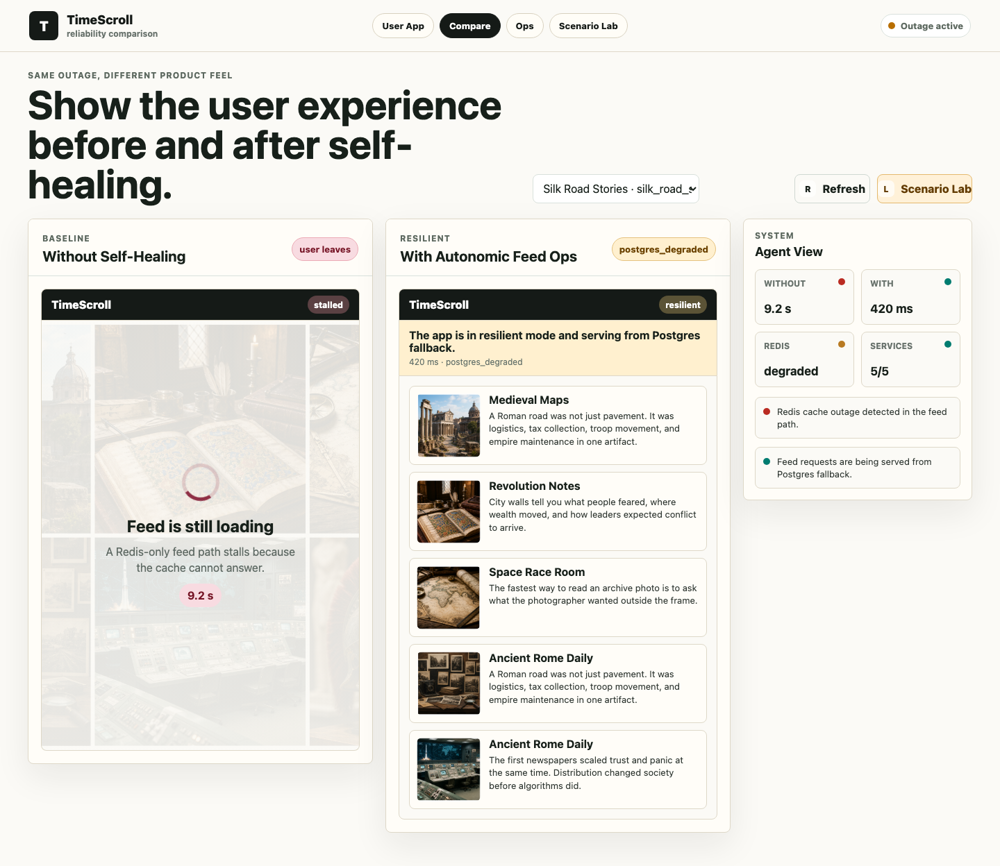
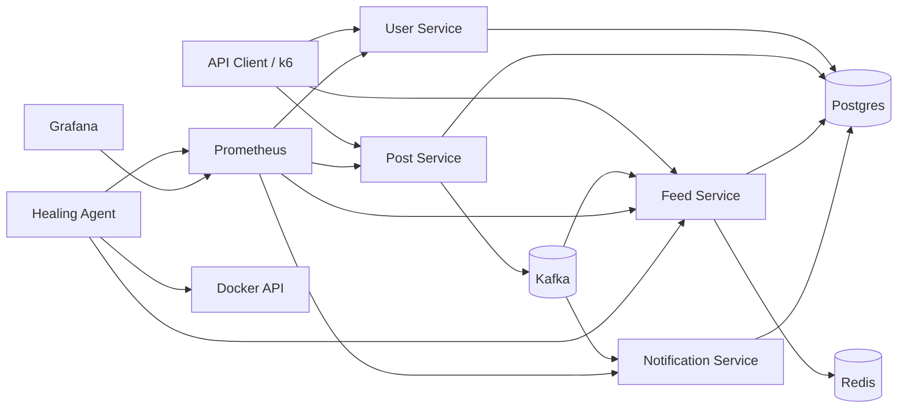

# Distributed Social Feed with AI Self-Healing

[](https://github.com/uujjrmi/distributed-social-feed/actions/workflows/ci.yml)

Distributed backend demo for a social feed with Kafka event streaming, Redis feed caching, Prometheus metrics, autonomous recovery, a mock history social app, and a neutral failure-injection lab.



## Why This Exists

Emerging social products can lose users when the feed feels unreliable. A 5-10 second feed load often feels like a product failure, but smaller teams usually do not have large operations teams watching every incident.

This project models a smaller social platform that keeps the feed usable during dependency failures. The healing agent watches live Prometheus signals, detects degradation, and takes corrective action such as enabling feed degraded mode or restarting failed services.

## What You Can Demo

- Use TimeScroll, a mock history social app, to show the user-facing feed.
- Compare the same Redis outage with and without self-healing.
- Create users, follows, posts, feeds, and notifications through real services.
- Materialize fanout feeds from Kafka events into Redis.
- Stop Redis and continue serving feeds from Postgres fallback.
- Watch the healing agent detect the Redis outage and enable degraded mode.
- Keep intentional outage controls separate in a neutral Scenario Lab.

## Demo Surfaces

| Surface | URL | Purpose |
| --- | --- | --- |
| TimeScroll User App | http://localhost:8080/social | Mock history social feed that represents what users experience. |
| Reliability Compare | http://localhost:8080/compare | Side-by-side view of baseline failure versus self-healing fallback. |
| Autonomic Feed Ops | http://localhost:8080/ops | Operator cockpit for service health, incidents, and recovery evidence. |
| Scenario Lab | http://localhost:8080/lab | Neutral harness for seeding data, generating traffic, and injecting outages. |

## Services

| Service | Port | Purpose |
| --- | ---: | --- |
| User Service | 8001 | Users and follow graph |
| Post Service | 8002 | Post writes and Kafka publishing |
| Feed Service | 8003 | Redis-backed feed reads and Kafka fanout consumer |
| Notification Service | 8004 | Notification consumer and API |
| Healing Agent | 8005 | Metrics-driven incident detection and remediation |
| Demo UI | 8080 | User app, comparison view, ops cockpit, and scenario lab |
| Prometheus | 9090 | Metrics store |
| Grafana | 3000 | Optional dashboards |

## Quick Start

```bash
cp .env.example .env
docker compose up --build
```

Open the mock social app:

```text
http://localhost:8080/social
```

The UI includes a mock history feed, reliability comparison, live service health, incident timeline, sample data generation, failure injection, feed traffic generation, and recovery controls. Failure injection lives in the Scenario Lab rather than the Autonomic Feed Ops cockpit.

For a guided recording flow:

```bash
make demo
```

To clear incident history and restore demo controls:

```bash
make reset-demo
```

Grafana is optional in Compose to keep the core stack lighter:

```bash
docker compose --profile dashboard up -d grafana
```

In another terminal:

```bash
make seed
make smoke
```

Useful URLs:

- User Service: http://localhost:8001/docs
- Post Service: http://localhost:8002/healthz
- Feed Service: http://localhost:8003/healthz
- Notification Service: http://localhost:8004/docs
- Healing Agent: http://localhost:8005/docs
- TimeScroll User App: http://localhost:8080/social
- Reliability Compare: http://localhost:8080/compare
- Autonomic Feed Ops: http://localhost:8080/ops
- Scenario Lab: http://localhost:8080/lab
- Prometheus: http://localhost:9090
- Grafana: http://localhost:3000

Grafana credentials default to `admin` / `admin`.

## Demo Flow

```bash
make demo
```

Or use the Scenario Lab at http://localhost:8080/lab to seed sample data, create posts, inject a Redis outage, generate feed traffic, and recover services. Keep http://localhost:8080/compare open to watch the product impact.

For the latest local resilience run, see [docs/benchmark-results.md](docs/benchmark-results.md).

Watch the Healing Agent:

```bash
curl http://localhost:8005/incidents
```

The first remediation path detects Redis errors from the Feed Service and enables degraded mode, so feed reads fall back to Postgres instead of failing outright.

## Architecture



## Failure Injection

```bash
./scripts/inject_failure.sh redis-outage
./scripts/inject_failure.sh feed-crash
./scripts/inject_failure.sh notification-crash
./scripts/inject_failure.sh consumer-lag
```

Recovery helpers:

```bash
docker compose up -d redis
docker compose up -d feed-service notification-service
curl -X POST http://localhost:8003/admin/degraded-mode \
  -H 'content-type: application/json' \
  -H 'x-admin-token: dev-admin-token' \
  -d '{"enabled": false}'
```

## Benchmarking

The k6 scripts live in `load/`.

```bash
k6 run load/k6-mixed.js
```

The headline availability number is computed as:

```text
availability = successful_requests / total_requests
```

Keep benchmark claims tied to saved k6 output and the machine used for the run.
